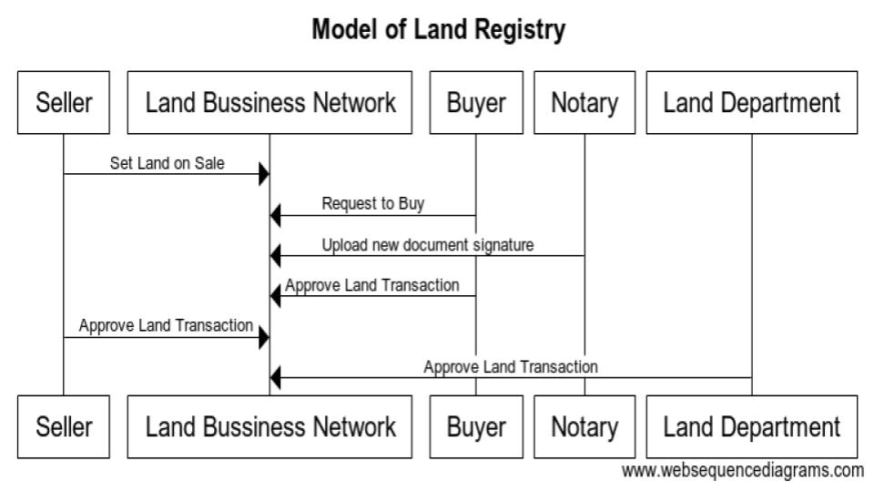

# landregistry

This project is only a sub part of whole land registry application developed on Hyperledger Fabric. Please visit it's parent repository to know about whole project via following link. 

This repository is business solution for the Land Registry Trust Management project. This project uses Hyperledger Composer tool to develop business solution. Hyperledger Composer is a tool made for developers to quickly create hyperledger chain code in javascript language without worry about any Hyperledger Fabric details. Please learn about this tool via following link.

https://www.hyperledger.org/projects/composer

## Business Solution

Following is the sequence diagram of the land registry transaction. Please keep in mind we have considered many assumption about the system. Model of the solution can be changed based on requirements.

First seller put its land on sale. Then buyer request to buy a land which is on sale. They hire Notary to create new land document. Notary uploads document signature of the new document. After that Buyer and Seller approves the transaction. At the last Land Department gives final approval and land transaction is done.

Following are the Assets, Participants involved in this solution

### Assets

1. Land : The main attribute of this asset is document signature. It stores hash of the land document. Anybody can check originality of the land document by comparing document signature.

2. PendingLandTransaction : This asset is created after land transfer is initiate by Buyer.

### Participants

1. PrivateIndividual :  He can be either Buyer or Seller. He may own lands.
   
2. Agent: Agent is a trustworthy person who acts as a mediatory between Buyer and Seller. He takes comission if transaction is sucessful.

3. Notary: He creates land transfer document.

4. Land Department: Approves land transfer.

## Deployment

We can create binary archive file using following command, which can be deployed on fabric network.

`composer archive create -t dir -n .`

Note: If you have modified any file please update version in package.json file.
This command requires composer cli to be installed on the system.

Above commond outputs `landregistry@<version_number>.bna` file.

To test our model this bna file may be deployed in Composer Playground. Please find more info on Playground via below link

https://composer-playground.mybluemix.net/